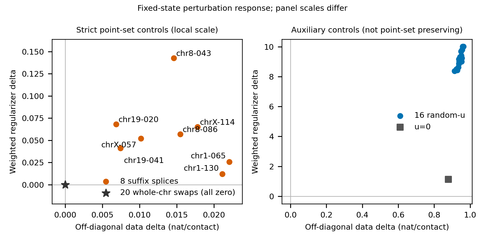
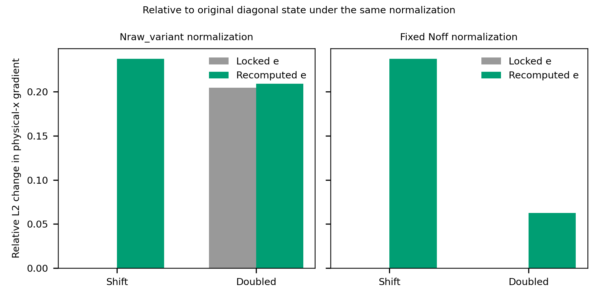
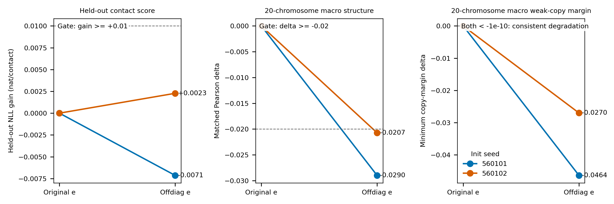

# Pro Review Experiments 056

This document is the concise external report for round 056. It reports a frozen, preregistered comparison of two exposure definitions under the same diploid shared-capture model. It does not replace the registered full-data baseline (`P9016-046-G-random-base-1Mb`) and does not revise the historical 049/055 results.

## Scope and decision

Round 056 tested whether replacing the production exposure estimate based on all training endpoints (`G-original`) with one based only on off-diagonal training endpoints (`G-offdiag-e`) should be adopted.

**Decision: do not adopt `G-offdiag-e` under the preregistered gates.** Both initialization seeds missed the held-out gain and structural matched-delta gates; both showed lower mean minimum copy margin and lower splice median than their paired `G-original` fits. This is a bounded result from one cell, two optimization initializations, and frozen budgets. It is not a global falsification of off-diagonal exposure methods.

No new L1 claim is made. Experiment 1 perturbs an already fitted baseline in sample, while the held-out comparison has no one-copy or consensus prediction control. The prior historical status remains: chr1 supports L1 and chrX is marginal. L2 remains unproven, and no L3 claim is made.

## Data split and model

- Input: `1,703,888` seven-column phase-free contact records. Every `readID` is `.`, so unknown molecule identity cannot be isolated. The split is honestly record-level, not molecule-level.
- Split: BLAKE2b-64 canonical-contact hash, seed `560301`, fixed threshold `14757395258967642112`.
- Train: `1,363,173` records. Test: `340,715` records. Train fraction: `0.8000367395`.
- Held-out primary denominator: `253,067` test off-diagonal records.
- Full 1 Mb eligible-pair normalizer: `3,496,690` pairs, including zero-count pairs.
- The same record fold is re-aggregated independently at 5, 2, and 1 Mb.
- `G-original` uses all training endpoints at each resolution, with diagonal counts contributing two endpoints. `G-offdiag-e` uses off-diagonal training endpoints at each resolution.
- Two seeds (`560101`, `560102`) are optimization initializations only, not biological replicates.

## Engineering and pre-reference controls

The new shared helper [`pr/solver_state.py`](../pr/solver_state.py) writes a finite immutable `solver_state.npz`, a separate Boolean `presence_mask.npz`, and exports coordinates through one track-aware helper. Round 056 runners use this helper and verify that export does not change the solver-state SHA256. The historical 051 chain and `fix_export.py` were not modified and must not be described as repaired.

The budget adapter [`code/budget_runner.py`](../test_res/056-20260916T152353Z-pro-review-experiments/code/budget_runner.py) retains the same SciPy L-BFGS-B algorithm and frozen optimization parameters while removing duplicate full-grid initialization/readback evaluations outside the declared budget. It is an accounting adaptation, not a byte-for-byte call to the old wrapper.

Before reference parsing, the run checked 90 actual artifacts: 46 experiment-1 states; four final solver states, presence masks, and exports; and 32 endpoint-splice states. The common structural support is the frozen 055 legacy mask: 20 chromosomes and exactly `157,529` pairs for every evaluated state.

## Experiment 1: fixed-state perturbations

Exactly 46 fixed 1 Mb states were evaluated: original (1), whole-chromosome swaps (20), suffix splices (8), `u=0` (1), and random-u controls (16).

- All hard invariance checks passed at absolute tolerance `<1e-10`.
- All `8/8` preregistered suffix splice data deltas were positive.
- Median suffix-splice delta: `0.0150419041367 nat/off-diagonal contact`.

The perturbation same/cross/contrast readouts use the frozen baseline chromosome mapping; whole-chromosome swaps transport that mapping. Fixed-map contrast may therefore be negative. `direct`/`swapped` and their best-global max/min are secondary fields and must not be confused with the fixed-map primary.

## Experiment 2: diagonal-count sensitivity

Twelve stored value-plus-gradient cells crossed three diagonal states, two exposure modes, and two denominators. No new fitting was performed.

- Locked exposure plus shifted diagonals was invariant to floating-point precision.
- Under production exposure and `Nraw_variant`, the primary shifted-diagonal physical-x gradient changed by `0.2374612358` in relative L2 norm.
- For doubled diagonal counts with locked exposure, the relative L2 change is `0.2047798486` under `Nraw_variant` but `1.56e-15` under fixed `Noff`. This separates denominator scaling from exposure coupling.

## Experiment 3: four endpoint results

All four fits used the full frozen `612 + 404 + 486 = 1502` FG budget. Every 5, 2, and 1 Mb stage ended `budget_not_converged / fg_budget_exhausted`. The paired 1 Mb canonical-gradient ratios were `1.47` and `1.12`; no preregistered optimization-imbalance alarm fired, but this does not establish convergence or optimizer equivalence.

The four rows below are endpoints trained on the same fixed 80% record fold. Their test NLL uses the same 20% record fold, and structural metrics use the same 055 support. They are not the full-data 046 baseline and must not be interpreted as a single-factor training comparison against it.

| Condition | Seed | Test NLL / offdiag | Same | Cross | Mean margin A | Mean margin B | Mean min-margin | 1 Mb canonical grad | Terminal |
| --- | ---: | ---: | ---: | ---: | ---: | ---: | ---: | ---: | --- |
| G-original | 560101 | 13.489889 | 0.598012 | 0.372697 | 0.220102 | 0.230528 | 0.165548 | 0.0004320 | budget_not_converged |
| G-offdiag-e | 560101 | 13.497027 | 0.569027 | 0.380981 | 0.183706 | 0.192387 | 0.119150 | 0.0002938 | budget_not_converged |
| G-original | 560102 | 13.505434 | 0.594509 | 0.391797 | 0.174412 | 0.231012 | 0.118167 | 0.0003926 | budget_not_converged |
| G-offdiag-e | 560102 | 13.503157 | 0.573787 | 0.395596 | 0.132429 | 0.223954 | 0.091150 | 0.0003492 | budget_not_converged |

Machine-readable endpoint rows: [`results/summary.tsv`](../test_res/056-20260916T152353Z-pro-review-experiments/results/summary.tsv).

### Paired preregistered readouts

| Seed | Held-out gain, original minus offdiag-e | Matched Pearson delta, offdiag-e minus original | Min-margin delta | Optimization imbalance alarm |
| ---: | ---: | ---: | ---: | --- |
| 560101 | -0.007138 | -0.028986 | -0.046398 | no |
| 560102 | +0.002277 | -0.020721 | -0.027017 | no |

The held-out gate was `>= +0.01 nat/contact` for both seeds. The matched structural gate was `>= -0.02` for both seeds. Both gates failed. Minimum margin degraded for both seeds. All four endpoints still had `8/8` positive splice deltas, but the splice median was lower under `G-offdiag-e` for both seeds (`0.00737` vs `0.00916`; `0.00779` vs `0.00949`).

Paired machine record: [`results/final_status.json`](../test_res/056-20260916T152353Z-pro-review-experiments/results/final_status.json). Per-chromosome structural values: [`reference_eval/per_chromosome.tsv`](../test_res/056-20260916T152353Z-pro-review-experiments/reference_eval/per_chromosome.tsv).

## Limits and audit notes

- One cell only. The 20 chromosomes are associated measurements within that cell, not biological replicates.
- Four fits are optimization runs from two initializations, and all are budget-not-converged.
- Unknown molecule identity is unavailable because every read identifier is `.`.
- The held-out direction differs between seeds and neither reaches the gate; predictive evidence is threshold-not-met/uncertain.
- No new L1 proof is claimed. L2 remains unproven. No L3 or global method-falsification claim is made.
- The unresolved-orientation tie branch was corrected to retain signed per-copy margins. Existing round-056 values are unchanged: all 20 best-orientation ties are the `exp1/u0` control evaluated under the frozen fixed mapping; zero experiment-3 endpoint or splice rows are affected.
- Experiment-1 inter-pair rate and sorted-four arrays were computed in memory, but only shapes, hashes, and maximum differences were retained. Reproducing the full arrays requires recomputation.
- Reference evaluation process CPU and wall time were not captured and are reported as `null/not_recorded`. Static workload is 82 states x 20 chromosomes x four distance arrays and four Pearson correlations per chromosome.
- [`results/artifact_hashes.json`](../test_res/056-20260916T152353Z-pro-review-experiments/results/artifact_hashes.json) is a local-run audit inventory. Many files listed there are intentionally excluded from this GitHub review snapshot; the hash inventory is not evidence that those artifacts were published.
- Raw/derived contacts, fitted coordinates, solver states, masks, exports, checkpoints, gradient arrays, complete optimization histories, and large logs are not distributed.

## Published evidence map

- Frozen protocol: [`PROTOCOL.md`](../test_res/056-20260916T152353Z-pro-review-experiments/PROTOCOL.md) and [`PROTOCOL_CLARIFICATIONS.md`](../test_res/056-20260916T152353Z-pro-review-experiments/PROTOCOL_CLARIFICATIONS.md)
- Internal run report: [`README.md`](../test_res/056-20260916T152353Z-pro-review-experiments/README.md)
- Final decision: [`results/final_status.json`](../test_res/056-20260916T152353Z-pro-review-experiments/results/final_status.json)
- Four endpoint table: [`results/summary.tsv`](../test_res/056-20260916T152353Z-pro-review-experiments/results/summary.tsv)
- Budget ledger: [`results/budget_ledger.json`](../test_res/056-20260916T152353Z-pro-review-experiments/results/budget_ledger.json)
- Validation: [`results/validation.json`](../test_res/056-20260916T152353Z-pro-review-experiments/results/validation.json)
- Reference summary and per-chromosome table: [`reference_eval/metrics.json`](../test_res/056-20260916T152353Z-pro-review-experiments/reference_eval/metrics.json), [`reference_eval/per_chromosome.tsv`](../test_res/056-20260916T152353Z-pro-review-experiments/reference_eval/per_chromosome.tsv)

The registered baseline remains `P9016-046-G-random-base-1Mb`; see [`CURRENT_BASELINE.md`](CURRENT_BASELINE.md).
